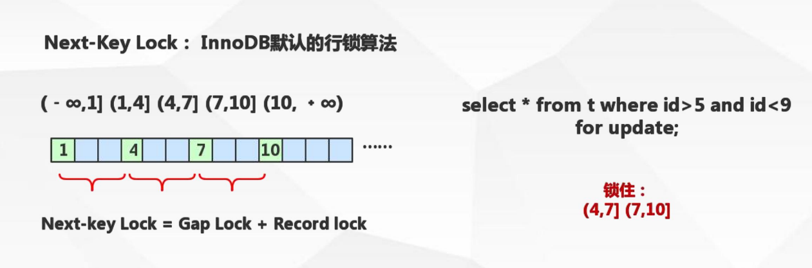
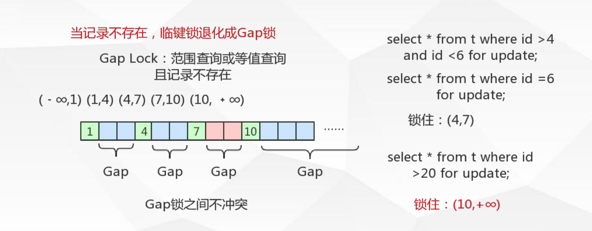
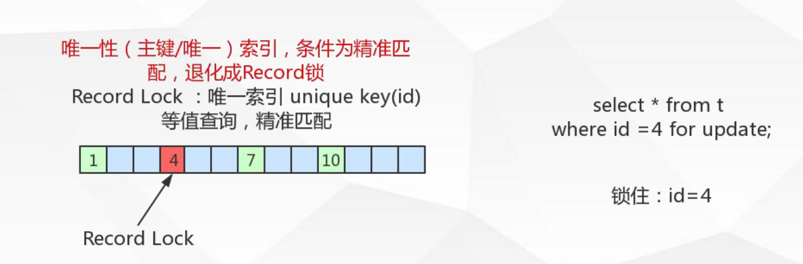
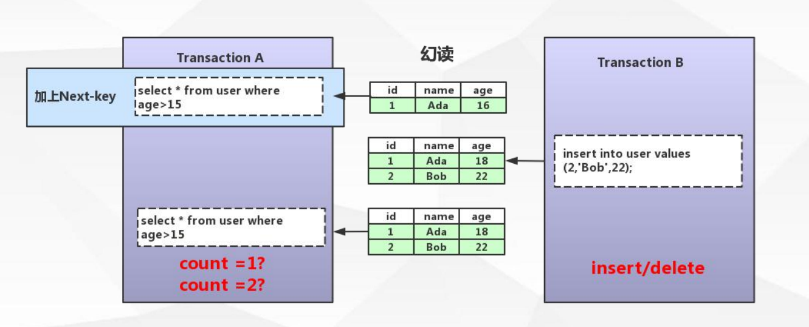

# MySQL 笔记


InnoDB 索引实现

##### 表数据文件本身就是按B+Tree组织的一个索引结构文件

##### 聚集索引-叶节点包含了完整的数据记录

（非聚集索引，索引文件中不存储数据，而是存储磁盘空间的引用地址）

##### InnoDB必须有主键，并且一件使用整型的自增主键!

InnoDB 如果没有主键，B+Tree的结构就无法维护，不增加主键的话，它会帮你增加个默认的 类似 rowId

##### 非主键索引结构叶子结点存储的是主键值 （一致性和节省存储空间）

 ##### 联合索引的底层数据结构   --索引最左前缀原理

### 事物ACID特性

#### 原子性 （Atomicity）

 最小的工作单元，整个工作单元要么一起提交成功，要么全部失败回滚 

####  一致性（Consistency） 

 事务中操作的数据及状态改变是一致的，即写入资料的结果必须完全符合预设的规则， 不会因为出现系统意外等原因导致状态的不一致 

####  隔离性（Isolation） 

 一个事务所操作的数据在提交之前，对其他事务的可见性设定（一般设定为不可见） 

####  持久性（Durability） 

 事务所做的修改就会永久保存，不会因为系统意外导致数据的丢失  

### 事务的四种隔离级别

#### 1、Read Uncommitted（未提交读）--未解决并发问题

​	事务误提交对其他事务也是可见的、脏读

#### 2、Read Committed （提交读）解决脏读

​	一个事务开始之后，只能看见自己提交的事务所做的修改，不可重复读

#### 3、Repeatable Read （可重复读） --解决不可重复读问题

​	在同一个事务中多次读取同样的数据结果是一样的，这种隔离级别未定义解决欢度 问题

#### 4、Serializable (串行化)  --解决所有问题

​	--最高的隔离级别、通过强制事务的串行执行

## 隔离级别的实现

 锁是用于管理不同事务对共享资源的并发访问 

### MySql InnoDB锁类型

##### 共享锁（行锁）：Shared Locks

##### 排它锁（行锁）：Exclusive Locks

##### 意向锁共享锁（表锁）: Intention Shared Lock 

#####  意向锁排它锁（表锁）：Intention Exclusive Lock 

#####  自增锁：AUTO-INC Lock 

### 行锁的算法

##### 记录锁 Record Locks

##### 间隙锁 Gap Locks 

##### 临键锁 Next-key Locks 

### 共享锁  VS  排它锁

##### 共享锁：

​	又称为读锁，简称S锁，顾名思义就是多个事务对于同一数据可以共享一把锁，都能访问到数据，但只能读不能修改，

  加锁方式： select * from users WHERE id=1 LOCK IN SHARE MODE; 

​					  commit/rollback 

##### 排他锁：

​	又称为写锁，简称X锁，排它锁不能与其他锁并存，如一个事务获取了一个数据行的排它锁，其他事务就不能获取该行的锁（共享锁、排它锁），只有获取了排他锁的事务是可以对数据进行读取和修改的，（其他事务要是读取数据可以来自于快照）

加锁方式： delete / update / insert 默认加上X锁 

​					SELECT * FROM table_name WHERE ... FOR UPDATE 	     							

​					commit/rollback  

### innodb - 行锁到底锁了什么

Innodb 的行锁是通过给索引上的索引项加锁实现的

只有通过索引条件进行数据检索，InnoDB才使用行级锁，否则，InnoDB将使用表锁（锁住索引的所有记录）

表锁：   lock tables xx read/write;


### 意向锁共享锁 (IS) & 意向锁排它锁（IX）

#####  意向共享锁(IS) 

​		表示事务准备给数据行加入共享锁，即一个数据行加共享锁前必须先取得该表的IS锁， 意向共享锁之间是可以相互兼容的 

#####  意向排它锁(IX) 

​		表示事务准备给数据行加入排他锁，即一个数据行加排他锁前必须先取得该表的IX锁， 意向排它锁之间是可以相互兼容的 

#####  意向锁(IS、IX)是InnoDB数据操作之前自动加的，不需要用户干预 

##### 意义：

 当事务想去进行锁表时，可以先判断意向锁是否存在，存在时则可快速返回该表不能启用表锁  

### 自增锁 AUTO_INC Locks

针对自增列自增长的一个特殊的表级别所

 show variables like 'innodb_autoinc_lock_mode' 

 默认取值1，代表连续，事务未提交ID永久丢失  

### 记录锁（Record）&间隙锁(Gap)&临键锁（Next-key）

#####  Next-key locks 临键锁： 

​		锁住记录+区间（左开右闭） 当sql执行按照索引进行数据的检索时,查询条件为范围查找（between and、<、>等）并有数 据命中则此时SQL语句加上的锁为Next-key locks，锁住索引的记录+区间（左开右闭） 



#####  Gap locks 间隙锁： 

​		锁住数据不存在的区间（左开右开） 当sql执行按照索引进行数据的检索时，查询条件的数据不存在，这时SQL语句加上的锁即为 Gap locks，锁住索引不存在的区间（左开右开） 



 Gap只在RR可重复读事务隔离级别存在  

##### Record locks 记录锁：

 		锁住具体的索引项 当sql执行按照唯一性（Primary key、Unique key）索引进行数据的检索时，查询条件等值匹 配且查询的数据是存在，这时SQL语句加上的锁即为记录锁Record locks，锁住具体的索引项  



### 问题解决

##### 利用锁解决脏读： 加 排他X 锁

##### 利用锁解决不可重复读： 加 排他S 锁

##### 利用锁解决幻读： 加 临键锁 



## 死锁介绍：

```txt
多并发任务（两个及以上）
每个事务都持有锁（或者都在等待锁）
每个事务都需要再继续持有锁
事务之间产生锁的循环等待，形成死锁

```

## 死锁的避免

类似的业务逻辑以固定的顺序进行访问表和行

大事务拆小。大事务更倾向于死锁，若果业务允许，将大事务拆小。

在同一个事务中，尽可能做到一次锁定所需要的所有资源，减少死锁的概率

降低隔离级别、如果业务允许，将隔离级别调低也是较好的选择

为表添加合理的索引，可以看到如果不走索引将会为表的每一行记录添加上锁（或者说是表锁）


### MVCC: Multiversion concurrency control (多版本并发控制)

 并发访问(读或写)数据库时，对正在事务内处理的数据做 多版本的管理。以达到用来避免写操作的堵塞，从而引发读操 作的并发问题 

## Undo log

​    undo 意为取消，以撤销操作为目的，返回指定某个状态的操作。

​    undo log 指事务开始之前，在操作任何数据之前，首先将操作的数据备份到一个地方（undo log）

##### UndoLog 是为了实现事务原子性出现的产物

UndoLog 实现事务的原子性：

​	事务处理过程中如果出现了错误或者用户执行了 rollback 语句，mysql可以利用UndoLog 中的备份 将数据恢复到事务开始之前的状态

##### UndoLog 在MySql innodb存储引擎中来实现多版本并发控制

Undo log 实现多版本并发控制：

​		事务未提交之前，Undo保存了未提交之前的版本数据，Undo中的数据可作为数据旧版本快照供其他并发事务进行快照读

### 当前读、快照读

 快照读： SQL读取的数据是快照版本，也就是历史版本，普通的SELECT就是快照读 innodb快照读，数据的读取将由 cache(原本数据) + undo(事务修改过的数据) 两部分组成 

 当前读： SQL读取的数据是最新版本。通过锁机制来保证读取的数据无法通过其他事务进行修改 UPDATE、DELETE、INSERT、SELECT … LOCK IN SHARE MODE、SELECT … FOR UPDATE都是 当前读  

## Redo log

 Redo Log 是什么： 

​		Redo，顾名思义就是重做。以恢复操作为目的，重现操作；

​		 Redo log指事务中操作的任何数据,将最新的数据备份到一个地方 (Redo Log) 

 Redo log的持久：

​		不是随着事务的提交才写入的，而是在事务的执行过程中，便开始写入redo 中。具体 的落盘策略可以进行配置 

 RedoLog是为了实现事务的持久性而出现的产物 

 Redo Log实现事务持久性： 防止在发生故障的时间点，尚有脏页未写入磁盘，在重启mysql服务的时候，根据redo log进行重做，从而达到事务的未入磁盘数据进行持久化这一特性。  


 指定Redo log 记录在{datadir}/ib_logfile1&ib_logfile2 可通过innodb_log_group_home_dir 配置指定 目录存储 一旦事务成功提交且数据持久化落盘之后，此时Redo log中的对应事务数据记录就失去了意义，所 以Redo log的写入是日志文件循环写入的 

指定Redo log日志文件组中的数量  `` innodb_log_files_in_group 默认为2 ``

指定Redo log每一个日志文件最大存储量  ``innodb_log_file_size 默认48M ``

指定Redo log在cache/buffer中的buffer池大小  ``innodb_log_buffer_size 默认16M ``

Redo buffer 持久化Redo log的策略，

 Innodb_flush_log_at_trx_commit： 取值 0 每秒提交 Redo buffer --> Redo log OS cache -->flush cache to disk[可能丢失一秒内 的事务数据] 

​																取值 1 默认值，每次事务提交执行Redo buffer --> Redo log OS cache -->flush cache to disk [最安全，性能最差的方式] 

​																取值 2 每次事务提交执行Redo buffer --> Redo log OS cache 再每一秒执行 ->flush cache to disk操作  

# 优化配置

## MySQL 服务器参数类型

#### 基于参数的作用域

全局参数  set global autocommit = ON/OFF; 

绘画参数（ 会话参数不单独设置则会采用全局参数)   

set session   autocommit =   ON/OFF; 

 注意： 全局参数的设定对于已经存在的会话无法生效 会话参数的设定随着会话的销毁而失效 全局类的统一配置建议配置在默认配置文件中，否则重启服务会导致配置失效  


 mysql --help 寻找配置文件的位置和加载顺序 Default options are read from the following files in the given order: /etc/my.cnf /etc/mysql/my.cnf /usr/etc/my.cnf ~/.my.cnf 

``mysql --help | grep -A 1 'Default options are read from the following files in the given order'  ``

#### 全局配置文件配置

 最大连接数配置 max_connections 

系统句柄数配置 /etc/security/limits.conf ulimit -a mysql

句柄数配置 /usr/lib/systemd/system/mysqld.service 

##### 常见全局配置文件配置

```properties
 port = 3306 
 socket = /tmp/mysql.sock 
 basedir = /usr/local/mysql 
 datadir = /data/mysql 
 pid-file = /data/mysql/mysql.pid 
 user = mysql 
 bind-address = 0.0.0.0 
 max_connections=2000 
 lower_case_table_names = 0 #表名区分大小写 
 server-id = 1 
 tmp_table_size=16M 
 transaction_isolation = REPEATABLE-READ 
 ready_only= 1
```

#### MySql 内存参数配置 

#####  每一个connection内存参数配置：

​	 sort_buffer_size connection排序缓冲区大小  建议256K(默认值)-> 2M之内 

当查询语句中有需要文件排序功能时，马上为connection分配配置的内 存大小 

   join_buffer_size connection关联查询缓冲区大小 

   建议256K(默认值)-> 1M之内 

 当查询语句中有关联查询时，马上分配配置大小的内存用这个关联查 询，所以有可能在一个查询语句中会分配很多个关联查询缓冲区 

 上述配置4000连接占用内存： 4000*(0.256M+0.256M) = 2G  

######  Innodb_buffer_pool_size 

​		innodb buffer/cache的大小（默认128M） 

 Innodb_buffer_pool 

​		数据缓存 

​		索引缓存 

​		缓冲数据

 		内部结构 

 大的缓冲池可以减小多次磁盘I/O访问相同的表数据以提高性能 

####  参考计算公式： Innodb_buffer_pool_size = （总物理内存 - 系统运行所用 - connection 所用）* 90%  

 `wait_timeout` 服务器关闭非交互连接之前等待活动的秒数 

 `innodb_open_files` 限制Innodb能打开的表的个数 

 `innodb_write_io_threads 、	innodb_read_io_threads` innodb使用后台线程处理innodb缓冲区数据页上的读写 I/O(输入输出)请求 

 `innodb_lock_wait_timeout` InnoDB事务在被回滚之前可以等待一个锁定的超时秒数 

# 数据库设计

 第一范式（ 1NF）： 字段具有原子性,不可再分。 所有关系型数据库系统都满足第一范式）数据库表中的字 段都是单一属性的， 不可再分；

 第二范式（ 2NF）： 要求实体的属性完全依赖于主键。 所谓完全依赖是指不能存在仅依赖主键一部分的属性， 如果存在， 那么这个属性和主关键字的这一部分应该分离出来形成一个新的实体， 新实体与原 实体之间是一对多的关系。为实现区分通常需要为表加上一个列，以存储各个实例的惟一标识。 简而言之， 第二范式就是属性完全依赖主键。

 第三范式（ 3NF）： 满足第三范式（ 3NF） 必须先满足第二范式（ 2NF）。 简而言之， 第三范式（ 3NF） 要求一个数据库表中不包含已在其它表中已包含的非主键信息。 简单一点： 1， 每一列只有一个单一的值，不可再拆分 2， 每一行都有主键能进行区分 3， 每一个表都不包含其他表已经包含的非主键信息 


#####  充分的满足第一范式设计将为表建立太量的列 

​		数据从磁盘到缓冲区，缓冲区脏页到磁盘进行持久的过程中，列的数量过多 会导致性能下降。过多的列影响转换和持久的性能 


##### 过分的满足第三范式化造成了太多的表关联 

​		表的关联操作将带来额外的内存和性能开销 


##### 使用innodb引擎的外键关系进行数据的完整性保证 

​		外键表中数据的修改会导致Innodb引擎对外键约束进行检查，就带来了额外 的开销  


## 执行计划

type：连接类型

  system：表只有一行记录，相当于系统表

  const：通过索引一次就找到，只匹配一行数据

  eq_ref: 唯一性索引扫描，对于每个索引键，表中只有一条记录与之匹配

  ref：非唯一性索引扫描，返回匹配某个单独值的所有行

​      用于=、<、> 操作符带索引的列

  range：只检索给定范围的行，使用一个索引来选择行

​        一般使用 between、<、>

  index：只遍历索引树

  ALL：全表扫描，性能最差 