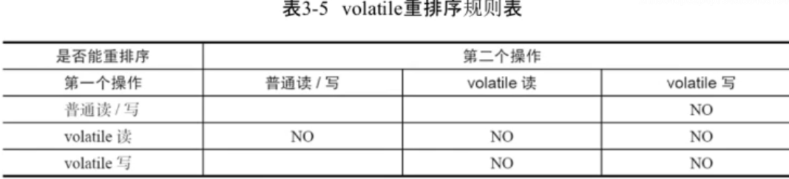
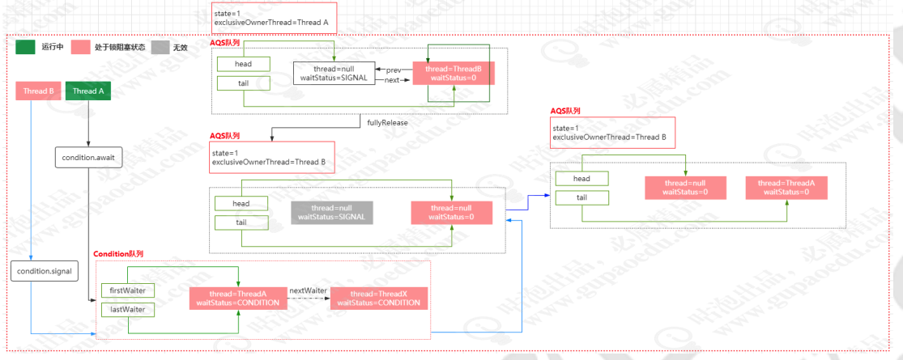

##   线程基础

##  死锁/活锁 死锁：

 一组互相竞争资源的线程因互相等待，导致“永久”阻塞的现象。 活锁： 活锁指的是任务或者执行者没有被阻塞，由于某些条件没有满足，导致一直重复尝试—失败—尝 试—失败的过程。处于活锁的实体是在不断的改变状态，活锁有可能自行解开 

##  死锁发生的条件 

 这四个条件同时满足，就会产生死锁。 

​	互斥，共享资源 X 和 Y 只能被一个线程占用； 

​	占有且等待，线程 T1 已经取得共享资源 X，在等待共享资源 Y 的时候，不释放共享资源 X；

 	不可抢占，其他线程不能强行抢占线程 T1 占有的资源；
 	
 	循环等待，线程 T1 等待线程 T2 占有的资源，线程 T2 等待线程 T1 占有的资源，就是循环等待。 

##  如何解决死锁问题 

 按照前面说的四个死锁的发生条件，我们只需要破坏其中一个，就可以避免死锁的产生。

 其中，互斥这个条件我们没有办法破坏，因为我们用锁为的就是互斥，其他三个条件都有办法可以破坏  

 对于“占用且等待”这个条件，我们可以一次性申请所有的资源，这样就不存在等待了。

 对于“不可抢占”这个条件，占用部分资源的线程进一步申请其他资源时，如果申请不到，可以主动 释放它占有的资源，这样不可抢占这个条件就破坏掉了。 

对于“循环等待”这个条件，可以靠按序申请资源来预防。所谓按序申请，是指资源是有线性顺序 的，申请的时候可以先申请资源序号小的，再申请资源序号大的，这样线性化后自然就不存在循环 了。 

##  Thread.join 

 Thread.join，这个内容在我讲Happens-Before可见性模型的时候讲过，它的作用其实就是让线程的执 行结果对后续线程的访问可见。 

##  ThreadLocal 

 线程隔离机制。 解决线程安全问题

ThreadLocal实际上一种线程隔离机制，也是为了保证在多线程环境下对于共享变量的访问的安全性。 

```java
static ThreadLocal<Integer> local=new ThreadLocal<Integer>(){
	protected Integer initialValue(){
		return 0; //初始化一个值
	}
};
public static void main(String[] args) {
	Thread[] thread=new Thread[5];
	for (int i=0;i<5;i++){
		thread[i]=new Thread(()->{
		int num=local.get(); //获得的值都是0
		local.set(num+=5); //设置到local中
		System.out.println(Thread.currentThread().getName()+"-"+num);
	});
	}
	for (int i = 0; i < 5; i++) {
		thread[i].start();
	}
}
```

## ThreadLocal原理分析

set方法最终实现

根据key的散列哈希计算Entry的数组下标
通过线性探索探测从i开始往后一直遍历到数组的最后一个Entry
如果map中的key和传 入的key相等，表示该数据已经存在，直接覆盖
如果map中的key为空，则用新的key、value覆盖，并清理key=null的数据
rehash扩容

```java
private void set(ThreadLocal<?> key, Object value) {
    Entry[] tab = table;
    int len = tab.length;
    // 根据哈希码和数组长度求元素放置的位置，即数组下标
    int i = key.threadLocalHashCode & (len-1);
    //从i开始往后一直遍历到数组最后一个Entry(线性探索)
    for (Entry e = tab[i];e != null; e = tab[i = nextIndex(i, len)]) {
        ThreadLocal<?> k = e.get();
        //如果key相等，覆盖value
        if (k == key) {
            e.value = value;
            return;
        }
        //如果key为null,用新key、value覆盖，同时清理历史key=null的陈旧数据(弱引用)
        if (k == null) {
            replaceStaleEntry(key, value, i);
            return;
        }
    }
    tab[i] = new Entry(key, value);
    int sz = ++size;
    //如果超过阀值，就需要扩容了
    if (!cleanSomeSlots(i, sz) && sz >= threshold)
    rehash();
}

```

 线性探测，是用来解决hash冲突的一种策略。它是一种开放寻址策略，利用hash表，它是根据key进行直接访问的数据结构，也就是说我们可以通过 hash函数把key映射到hash表中的一个位置来访问记录，从而加快查找的速度。存放记录的数据 就是hash表（散列表） 当我们针对一个key通过hash函数计算产生的一个位置，在hash表中已经被另外一个键值对占用 时，那么线性探测就可以解决这个冲突，这里分两种情况。 写入： 查找hash表中离冲突单元最近的空闲单元，把新的键值插入到这个空闲单元 查找： 根据hash函数计算的一个位置处开始往后查找，直到找到与key对应的value或者找到空的 单元。 

###  replaceStaleEntry 

 清理的过程和替换过程，。  

```java
private void replaceStaleEntry(ThreadLocal<?> key, Object value,
    int staleSlot) {
    Entry[] tab = table;
    int len = tab.length;
    Entry e;
    //向前扫描，查找最前一个无效的slot
    int slotToExpunge = staleSlot;
    for (int i = prevIndex(staleSlot, len);(e = tab[i]) != null;i = prevIndex(i, len))
        if (e.get() == null)
        //通过循环遍历，可以定位到最前面一个无效的slot
        slotToExpunge = i;
        //从i开始往后一直遍历到数组最后一个Entry（线性探索）
            for (int i = nextIndex(staleSlot, len);(e = tab[i]) != null; i = nextIndex(i, 					len)) {
            	ThreadLocal<?> k = e.get();
                //找到匹配的key以后
                if (k == key) {
      			 	 e.value = value;//更新对应slot的value值
   					 //与无效的sloat进行交换
   					 tab[i] = tab[staleSlot];
   					 tab[staleSlot] = e;
                    //如果最早的一个无效的slot和当前的staleSlot相等，则从i作为清理的起点
                    if (slotToExpunge == staleSlot)
                        slotToExpunge = i;
                        //从slotToExpunge开始做一次连续的清理
                        cleanSomeSlots(expungeStaleEntry(slotToExpunge), len);
                        return;
                    }
                //如果当前的slot已经无效，并且向前扫描过程中没有无效slot，则更新slotToExpunge为当前位置
                if (k == null && slotToExpunge == staleSlot)
               	 slotToExpunge = i;
                }
            //如果key对应的value在entry中不存在，则直接放一个新的entry
            tab[staleSlot].value = null;
            tab[staleSlot] = new Entry(key, value);
            //如果有任何一个无效的slot，则做一次清理
            if (slotToExpunge != staleSlot)
           	 cleanSomeSlots(expungeStaleEntry(slotToExpunge), len);
}
```

##  线性探测 

 用来解决hash冲突的一种策略.

 写入 , 找到发生冲突最近的空闲单元

 查找, 从发生冲突的位置，往后查找 


### 偏向锁

 **偏向锁原理和升级过程** 

当线程1访问代码块并获取锁对象时，会在java对象头和栈帧中记录偏向的锁的threadID，因为偏向锁不会主动释放锁，因此以后线程1再次获取锁的时候，需要比较当前线程的threadID和Java对象头中的threadID是否一致，如果一致（还是线程1获取锁对象），则无需使用CAS来加锁、解锁；如果不一致（其他线程，如线程2要竞争锁对象，而偏向锁不会主动释放因此还是存储的线程1的threadID），那么需要查看Java对象头中记录的线程1是否存活，如果没有存活，那么锁对象被重置为无锁状态，其它线程（线程2）可以竞争将其设置为偏向锁；如果存活，那么立刻查找该线程（线程1）的栈帧信息，如果还是需要继续持有这个锁对象，那么暂停当前线程1，撤销偏向锁，升级为轻量级锁，如果线程1 不再使用该锁对象，那么将锁对象状态设为无锁状态，重新偏向新的线程。


### 轻量级锁

 **轻量级锁原理和升级过程** 

线程1获取轻量级锁时会先把锁对象的对象头MarkWord复制一份到线程1的栈帧中创建的用于存储锁记录的空间（称为DisplacedMarkWord），然后使用CAS把对象头中的内容替换为线程1存储的锁记录（DisplacedMarkWord）的地址；

如果在线程1复制对象头的同时（在线程1CAS之前），线程2也准备获取锁，复制了对象头到线程2的锁记录空间中，但是在线程2CAS的时候，发现线程1已经把对象头换了，线程2的CAS失败，那么线程2就尝试使用自旋锁来等待线程1释放锁。 自旋锁简单来说就是让线程2在循环中不断CAS

但是如果自旋的时间太长也不行，因为自旋是要消耗CPU的，因此自旋的次数是有限制的，比如10次或者100次，如果自旋次数到了线程1还没有释放锁，或者线程1还在执行，线程2还在自旋等待，这时又有一个线程3过来竞争这个锁对象，那么这个时候轻量级锁就会膨胀为重量级锁。重量级锁把除了拥有锁的线程都阻塞，防止CPU空转
、


Volatile

- 线程可见行问题

  ```java
  public static VolatileExample {
    public static volatile boolean stop = false;
    
    public static void main(String[] args) throws InterruptedException{
      Thread t1 = new Thread(()->{
        int i = 0;
        //活性失败
        //while(true)
        while(!stop){
          i++;
        }
      });
      t1.start();
      Ststem.out.println("begin start thread");
      Thread.sleep(1000);
      stop = true;
    }
  }
  ```

- 了解可见行本质

​	CPU资源的利用问题

​		CPU增加高速缓存

​		操作系统中，增加进程、线程，-> 通过C PU的时间片切换，提升CPU利用率

   	 编译器（JVM的深度优化）

- 从CPU层面了解可见行有序性问题

- JMM模型

- Happens- Before模型


# CPU的高速缓存

缓存行： CPU的缓存是由多个缓存行来组成，缓存行是CPU和内存交互的最小工作单元

伪共享问题

对齐填充：

x86系统中，CPU每次从内存中获取数据的时候，都是获取64个字节，比如获取到了XYZ 在一个缓存行中，现在有线程0 和1 来分别对X和Y进行修改，当线程0获取到执行权限，线程1就失去了权限，当线程1获取到了执行权限，线程0 就失去了权限，来来回回的操作就会 影响性能，所以通过对其填充的方式来解决问题（获取X 填充满64位，获取Y填充满64位），用空间换时间来提升性能

@Contended 加在类上就是实现对其填充


# 缓存一致性问题


- 总线锁: 在缓存上（BUS）加一个互斥锁

- 缓存锁：

​		缓存一致性协议（MESI，MOSI）

​		MESI表示缓存的四种状态，Modify修改，Invalidate 失效,E 独占， S共享

通过汇编指令 #Lock 来加总线锁或者缓存锁，由操作系统来决定 


# CPU层面的指令重排序

CPU层面、JVM层面、优化执行的执行顺序

```java
int a = 0;
int b = 0;
function(){
  a=1;
  b=a+1;
  assert(b==2);//false
}
// 指令重排
b=a+1;
a=1;
```

### Store Forwarding

```java
int a=0,b=0;
excuteToCPU0(){
  a=1;
  b=1;
}
excuteToCPU1(){
  while(b==1){
    assert(a==1)
  }
}
```


# 内存屏障

CPU层面不知道，什么时候不允许优化，什么时候允许优化

- 读屏障 （lFence）load，读屏障之前的操作必须在读屏障之前完成

- 写屏障  (sFence) save，写屏障之前的操作必须在写屏障之前完成

- 全屏障（mFence）mix，读写屏障之前的操作必须在屏障之前完成

Linux

smp_wmp 写屏障方法

smp_rmb 读屏障方法

smp_mb 读写屏障


# 可见性导致的原因

CPU的高速缓存

指令重排序


Lock

MSCI 协议保证CPU缓存的一致性


原子性、有序性、可见性

​	synchronized

​	volatile

​	final（也有内存屏障指令保证缓存的一致性）

final只能在构造方法中初始化

在构造方法中初始化的指令，不允许重排序到构造方法之外，这里用到了内存屏障指令

# 并不是所有的程序指令都会存在可见行或者指令重拍序问题


# Happens-Before（告诉你哪些场景不会存在可见性问题）

## 规则1: 程序顺序性规则（as-if-serial）

不管程序如何重排序，单线程的执行结果一定不会发生变化

```java
int a = 2;
int b = 1;
int c = a*b;
```

## 规则2: 传递性规则

如果 A happens before B

B happens before C

那么A happens before C    成立

## 规则3: volatile 变量规则



## 规则4:监视器锁规则

```java
int x = 10;
synchronized(this){  // 如果线程1获得了锁，并且执行玩释放了锁，那么线程2在获取锁后，它读取到的数据一定是线程1更改之后的，
  if(this.x<12){
    this.x = 12;
  }
}
```

## 规则5: start规则

```java
public class StartDemo{
  public static void main(String[] args){
    int x = 0;
    Thread t1 = new Thead(()->{
      // 读取x的值，一定是20
    });
    x = 20;
    t1.start();
  }
}
```

## 规则6: join规则

```java
public class JoinDemo extends Thread{
  
  @Override
  public void run(){
    
  }
 
  public static void main(String[] args){
    JoinDemo jd = new JoinDemo();
    jd.start();
    jd.join();//等待jd 线程运行结束 | 如果没有执行结束，会阻塞main 线程
    //TODO
  } 
}
```

# happens-before的规则，本质上就是描述的是可见性规则。


# J.U.C

Java.util.concurrent


Lock -> synchronized  锁是用来解决线程安全的问题


# ReentrantLock 的实现原理

重入锁 -> 互斥锁

满足线程的互斥特性

意味着同一个时刻，只允许一个线程进入到加锁的代码中， 多线程环境下，线程的顺序访问


# 锁的设计猜想

- 一定会涉及到锁的抢占，需要有一个标记来实现互斥，全局变量（0，1）
- 抢占到了锁，不需要处理
- 没抢占到锁，

  - 需要等待（让处于排队中的线程，如果没有抢占到锁，直接先阻塞->释放CPU资源）
    - 如何让线程等待
      - Wait/notify(线程通信机制，无法指定唤醒某个线程)
      - LockSupport.park/unpark(阻塞一个指定的线程，唤醒一个指定的线程)
      - Condition

  - 需要排队（允许有N个线程被阻塞，此时线程处于活跃状态）
    - 通过一个数据结构，把N个排队的线程存储起来
- 抢占到锁的释放过程，如何处理

  - LockSupport.unpark()->唤醒处于队列中的指定线程
- 锁抢占的公平性（是否允许插队）

  - 公平
  - 非公平


# AbstractQueuedSynchronizer （AQS）

- 共享锁

- 互斥锁


# Lock

ReentrantLock

公平锁

```java
final void lock(){
  acquire(1);// 抢占一把锁
}
public final void acquire(int arg) {
        if (!tryAcquire(arg) &&
            acquireQueued(addWaiter(Node.EXCLUSIVE), arg))
            selfInterrupt();
}
protected final boolean tryAcquire(int acquires) {
            final Thread current = Thread.currentThread();
            int c = getState();
            if (c == 0) {//表示无锁状态
                if (!hasQueuedPredecessors() &&
                    compareAndSetState(0, acquires)) {// CAS（#Lock） -> 原子操作
                    setExclusiveOwnerThread(current);//把获得锁的线程保存到ExclusiveOwnerThread
                    return true;
                }
            }
  					//如果当前获取锁的线程和当前抢占锁的线程是同一个，表示重入
            else if (current == getExclusiveOwnerThread()) {
                int nextc = c + acquires;//增加重入次数
                if (nextc < 0)
                    throw new Error("Maximum lock count exceeded");
                setState(nextc);//保存state
                return true;
            }
            return false;
        }
    }
```

非公平锁

```java
final void lock() {
  //不管当前AQS队列中是否存在排队的情况，先去插队
            if (compareAndSetState(0, 1))//返回false表示抢占失败
                setExclusiveOwnerThread(Thread.currentThread());
            else
                acquire(1);
}

        protected final boolean tryAcquire(int acquires) {
            return nonfairTryAcquire(acquires);
        }
final boolean nonfairTryAcquire(int acquires) {
            final Thread current = Thread.currentThread();
            int c = getState();
            if (c == 0) {
              //hasQueuedPredecessors 没有这个
                if (compareAndSetState(0, acquires)) {
                    setExclusiveOwnerThread(current);
                    return true;
                }
            }
            else if (current == getExclusiveOwnerThread()) {
                int nextc = c + acquires;
                if (nextc < 0) // overflow
                    throw new Error("Maximum lock count exceeded");
                setState(nextc);
                return true;
            }
            return false;
        }
```


## 加入队列并进行自旋等待

```java
public final void acquire(int arg) {
        if (!tryAcquire(arg) &&
             (addWaiter(Node.EXCLUSIVE), arg))
            selfInterrupt();
    }
```

acquireQueued(addWaiter(Node.EXCLUSIVE), arg))

- addWaiter(Node.EXCLUSIVE) ->添加一个互斥锁的节点
- acquireQueued()-> 自旋锁和阻塞的操作

```java
    /**
     * Creates and enqueues node for current thread and given mode.
     *
     * @param mode Node.EXCLUSIVE for exclusive, Node.SHARED for shared
     * @return the new node
     */
    private Node addWaiter(Node mode) {
       // 吧当前线程封装成一个node节点
        Node node = new Node(Thread.currentThread(), mode);//后续唤醒线程的时候，需要得到被唤醒的线程
        // Try the fast path of enq; backup to full enq on failure
        Node pred = tail;
        if (pred != null) {
            node.prev = pred;
            if (compareAndSetTail(pred, node)) {
                pred.next = node;
                return node;
            }
        }
        enq(node);
        return node;
    }
    /**
     * Inserts node into queue, initializing if necessary. See picture above.
     * @param node the node to insert
     * @return node's predecessor
     */
    private Node enq(final Node node) {
        for (;;) {//自旋
            Node t = tail;
            if (t == null) { // Must initialize
              	// 初始化一个head节点
                if (compareAndSetHead(new Node()))
                    tail = head;
            } else {
                node.prev = t;
                if (compareAndSetTail(t, node)) {
                    t.next = node;
                    return t;
                }
            }
        }
    }
```

```java
    /**
     * Acquires in exclusive uninterruptible mode for thread already in
     * queue. Used by condition wait methods as well as acquire.
     *
     * @param node the node 当前来抢占锁的线程
     * @param arg the acquire argument
     * @return {@code true} if interrupted while waiting
     */
    final boolean acquireQueued(final Node node, int arg) {
        boolean failed = true;
        try {
            boolean interrupted = false;
            for (;;) {//自旋
              // begin -》 尝试去获取锁
                final Node p = node.predecessor();// 获取前一个节点，
                if (p == head && tryAcquire(arg)) {//如果返回true，则不需要等待，直接返回。
                    setHead(node);
                    p.next = null; // help GC
                    failed = false;
                    return interrupted;
                } 
              //否则，让线程去阻塞
                if (shouldParkAfterFailedAcquire(p, node) &&
                    parkAndCheckInterrupt())// LockSupport.park() 
                    interrupted = true;
            }
        } finally {
            if (failed)
                cancelAcquire(node);
        }
    }
```

# 线程通信

共享内存

Wait/notify ->基于某个条件来等待或者唤醒


# Condition

等价于wait/notify. -> JUC 包中实现的wait/notify

- 在JUC中，锁的实现是Lock

- wait/notify 锁的实现是synchronized

# Condition的原理

- 作用：实现线程的阻塞和唤醒

- 前提条件：必须先获得锁

- wait/notify；signalAll

  - await -> 让线程阻塞 ，并且释放锁
  - signal -> 唤醒阻塞的线程

- 加锁的操作，必然会涉及到AQS的阻塞队列

- await 释放锁的时候，AQS队列中不存在已经释放锁的线程 ，这个释放的线程去了那里

- signal 唤醒被阻塞的线程-> 从那里唤醒

  通过await方法释放的线程，必须要有一个地方来存储，并且还需要被阻塞； 会存在一个等待队列，LocakSupport.park()阻塞

  signal 上面猜想到的等待队列中，唤醒一个线程，放哪里去？是不是应该再当到AQS队列中


# Condition的实现原理

1. 释放锁

2. 让释放的线程，应该被阻塞

3. 被阻塞之后存储仔阻塞队列中

4. 重新去竞争锁 -> AQS的逻辑

5. 能够处理Interrupt()的中断响应

   ```java
           /**
            * Implements interruptible condition wait.
            * <ol>
            * <li>If current thread is interrupted, throw InterruptedException.
            * <li>Save lock state returned by {@link #getState}.
            * <li>Invoke {@link #release} with saved state as argument,
            *     throwing IllegalMonitorStateException if it fails.
            * <li>Block until signalled or interrupted.
            * <li>Reacquire by invoking specialized version of
            *     {@link #acquire} with saved state as argument.
            * <li>If interrupted while blocked in step 4, throw InterruptedException.
            * </ol>
            */
           public final void await() throws InterruptedException {
               if (Thread.interrupted())
                   throw new InterruptedException();
             //添加到等待队列
               Node node = addConditionWaiter();
             //完整的释放锁
               int savedState = fullyRelease(node);
               int interruptMode = 0;
               while (!isOnSyncQueue(node)) {
                 // 上下文切换（程序计数器、寄存器）  用户态 到内核态的转换（上下文切换）
                   LockSupport.park(this);//阻塞当前线程（当其他线程调用signal()方法时候，该线程会从这个位置去执行）
                 //要判断当前被阻塞的线程是否是因为interrupt()唤醒
                   if ((interruptMode = checkInterruptWhileWaiting(node)) != 0)
                       break;
               }
             //重新竞争锁，savedState 表示的是被释放的锁的重入次数
               if (acquireQueued(node, savedState) && interruptMode != THROW_IE)
                   interruptMode = REINTERRUPT;
               if (node.nextWaiter != null) // clean up if cancelled
                   unlinkCancelledWaiters();
               if (interruptMode != 0)
                   reportInterruptAfterWait(interruptMode);
           }
   ```

   ```java
           /**
            * Adds a new waiter to wait queue.
            * @return its new wait node
            */
           private Node addConditionWaiter() {
               if (!isHeldExclusively())
                   throw new IllegalMonitorStateException();
               Node t = lastWaiter;
               // If lastWaiter is cancelled, clean out.
               if (t != null && t.waitStatus != Node.CONDITION) {
                   unlinkCancelledWaiters();
                   t = lastWaiter;
               }
   
               Node node = new Node(Node.CONDITION);
   
               if (t == null)
                   firstWaiter = node;
               else
                   t.nextWaiter = node;
               lastWaiter = node;
               return node;
           }
             
   ```

   




# signal

- 要把被阻塞的线程先唤醒
- 把等待队列中被唤醒的线程转移到AQS队列中

```java
        /**
         * Moves the longest-waiting thread, if one exists, from the
         * wait queue for this condition to the wait queue for the
         * owning lock.
         *
         * @throws IllegalMonitorStateException if {@link #isHeldExclusively}
         *         returns {@cod98e false}
         */
        public final void signal() {
            if (!isHeldExclusively())
                throw new IllegalMonitorStateException();
            Node first = firstWaiter;
            if (first != null)
                doSignal(first);
        }        
				/**
         * Removes and transfers nodes until hit non-cancelled one or
         * null. Split out from signal in part to encourage compilers
         * to inline the case of no waiters.
         * @param first (non-null) the first node on condition queue
         */
        private void doSignal(Node first) {
            do {
                if ( (firstWaiter = first.nextWaiter) == null)
                    lastWaiter = null;
                first.nextWaiter = null;
            } while (!transferForSignal(first) &&
                     (first = firstWaiter) != null);
        }

    /**
     * Transfers a node from a condition queue onto sync queue.
     * Returns true if successful.
     * @param node the node
     * @return true if successfully transferred (else the node was
     * cancelled before signal)
     */
    final boolean transferForSignal(Node node) {
        /*
         * If cannot change waitStatus, the node has been cancelled.
         */
        if (!node.compareAndSetWaitStatus(Node.CONDITION, 0))
            return false;

        /*
         * Splice onto queue and try to set waitStatus of predecessor to
         * indicate that thread is (probably) waiting. If cancelled or
         * attempt to set waitStatus fails, wake up to resync (in which
         * case the waitStatus can be transiently and harmlessly wrong).
         */
       //把当前从等待队列中的头部节点保存到AQS队列中
        Node p = enq(node);
        int ws = p.waitStatus;
        if (ws > 0 || !p.compareAndSetWaitStatus(ws, Node.SIGNAL))
            LockSupport.unpark(node.thread);//唤醒当前线程
        return true;
    }
```

# 再回到await方法

- 抢占锁即可

```java
        /**
         * Implements interruptible condition wait.
         * <ol>
         * <li>If current thread is interrupted, throw InterruptedException.
         * <li>Save lock state returned by {@link #getState}.
         * <li>Invoke {@link #release} with saved state as argument,
         *     throwing IllegalMonitorStateException if it fails.
         * <li>Block until signalled or interrupted.
         * <li>Reacquire by invoking specialized version of
         *     {@link #acquire} with saved state as argument.
         * <li>If interrupted while blocked in step 4, throw InterruptedException.
         * </ol>
         */
        public final void await() throws InterruptedException {
            if (Thread.interrupted())
                throw new InterruptedException();
            Node node = addConditionWaiter();
            int savedState = fullyRelease(node);
            int interruptMode = 0;
            while (!isOnSyncQueue(node)) {
                LockSupport.park(this);
                if ((interruptMode = checkInterruptWhileWaiting(node)) != 0)
                    break;
            }
            if (acquireQueued(node, savedState) && interruptMode != THROW_IE)
                interruptMode = REINTERRUPT;
            if (node.nextWaiter != null) // clean up if cancelled
                unlinkCancelledWaiters();
            if (interruptMode != 0)
                reportInterruptAfterWait(interruptMode);
        }
```

# Condition的实际应用

-> 实现阻塞队列（业务组件）

->在线程池中会应用到阻塞队列

->生产者消费者

 ->流量缓冲	

# 阻塞队列

队列是一种只允许 分别在两端进行增删操作的线性表，允许插入的一端叫做队尾、允许删除的一端叫做对头

阻塞队列在队列的基础之上增加了两个操作

- 支持阻塞插入：队列满了的情况下，会阻塞继续往队列中添加数据的线程，直到队列元素被释放
- 支持阻塞移除：队列为空的情况下，会阻塞从队列中获取元素的线程，直到队列添加了新的元素。

## 阻塞队列中的方法

- 添加元素

  针对队列满了之后的不同处理策略

  - add ->
  - offer -> true/false
  - put -> 
  - offer(timeout)

- 移除元素

  - element ->
  - peek -> true/false
  - take ->
  - poll(timeout)
  - dequeue->LIFO、FIFO 的队列

# SynchronousQueue

通过信息的传递来实现生产者和消费者的阻塞和唤醒

```java
    /**
     * Creates a {@code SynchronousQueue} with the specified fairness policy.
     *
     * @param fair if true, waiting threads contend in FIFO order for
     *        access; otherwise the order is unspecified.
     */
    public SynchronousQueue(boolean fair) {
        transferer = fair ? new TransferQueue<E>() : new TransferStack<E>();
    }
```

存储处于阻塞状态下的生产者线程，消费者线程

```java
public static ExecutorService newCachedThreadPool(){
  return new ThreadPoolExecutor(0,Integer.MAX_VALUE,60L,
                                TimeUnit.SECONDS,
                                new SynchronousQueue<Runnable>());
}
```

1000个请求放入到线程池， 必须找到一个线程来处理，1000个线程（生存周期是60s）

# LinkedTransfderQueue

无界阻塞队列

transfer能力

LinkedBlockingQueue + tacnsferQueue

# LinkedBlockingQueue

一个正常的基于链表结构的阻塞队列，无界队列

# LinedBlockingDeque

双向链表组成的队列

支持双向插入和移除

在一定程度上能够解决多线程的竞争问题

Fork/Join 工作窃取

# 阻塞队列的使用

责任链模式吧

构建一条执行链路	

# J.U.C并发工具

AQS 的共享锁

## CountDownLatch

计数器工具

await

countDown


- 可以让一个或多个线程阻塞

共享锁的实现

可以允许多个线程同时抢占到锁，然后等到计数器归零的时候，同时唤醒

- state记录计数器
- countDown的时候，实际上就是state--

## Semaphore

共享锁：因为同时可以释放多个令牌，那么意味着可以同时有多个线程抢占到锁

信号灯

限流器，限制资源的访问

本质上：抢占一个令牌，如果抢占到令牌就通行，否则就阻塞。

- acquire() 抢占一个令牌
- release()释放一个令牌

```java
Semashore aemashor = new Semashore(10);
```

acquire = 10-1;

- 为0的时候，阻塞
- 有可能阻塞N个线程

releas = 令牌+1

- 有令牌了，唤醒
- 从阻塞的线程中去唤醒


## CyclicBarrier

可重复的栅栏 

实现，相当于 ， 多个线程通过CountDownLatch的await 。然后另外一个线程使用countDown方法来 唤醒。

# Fork/Join

ForkJoinTask

- RecursiveAction：没有返回结果
- RecursiveTask
- CountedCompleter

Fork -> 让task异步执行

join -> 让task同步执行，等待获得返回值


ForkJoinPool ： 专门运行ForkJoinTask

​	

```java
public class ForkJoinTest {

    private static final Integer MAX = 200;

    static class CalcForkJoinTask extends RecursiveTask<Integer> {
        private Integer startValue; //子任务开始计算的值
        private Integer endValue; //子任务结束计算的值

        public CalcForkJoinTask(Integer startValue, Integer endValue) {
            this.startValue = startValue;
            this.endValue = endValue;
        }

        //运算过程
        @Override
        protected Integer compute() {
// 如果条件成立，说明这个任务所需要计算的数值拆分得足够小了，不需要再拆分可以正式进行累加计算了
            if (endValue - startValue < MAX) {
                System.out.println("开始计算的部分：startValue = " + startValue +
                        ";endValue = " + endValue);
                Integer totalValue = 0;
                for (int index = this.startValue; index <= this.endValue; index++) {
                    totalValue += index;
                }
                return totalValue;
            }
            //否则，对数字进行拆分，拆分成两个任务计算
            CalcForkJoinTask subTask1 = new CalcForkJoinTask(startValue,
                    (startValue + endValue) / 2);
            subTask1.fork();
            CalcForkJoinTask subTask2 = new
                    CalcForkJoinTask((startValue + endValue) / 2 + 1, endValue);
            subTask2.fork();
            return subTask1.join() + subTask2.join();
        }
    }

    public static void main(String[] args) {
        ForkJoinPool pool = new ForkJoinPool(); //通过ForkJoinPool来执行ForkJoinTask
        ForkJoinTask<Integer> taskFuture = pool.submit(new
                CalcForkJoinTask(1, 2002));
        try {
            Integer result = taskFuture.get();
            System.out.println("result:" + result);
        } catch (InterruptedException e) {
            e.printStackTrace();
        } catch (ExecutionException e) {
            e.printStackTrace();
        }
    }
}
```

